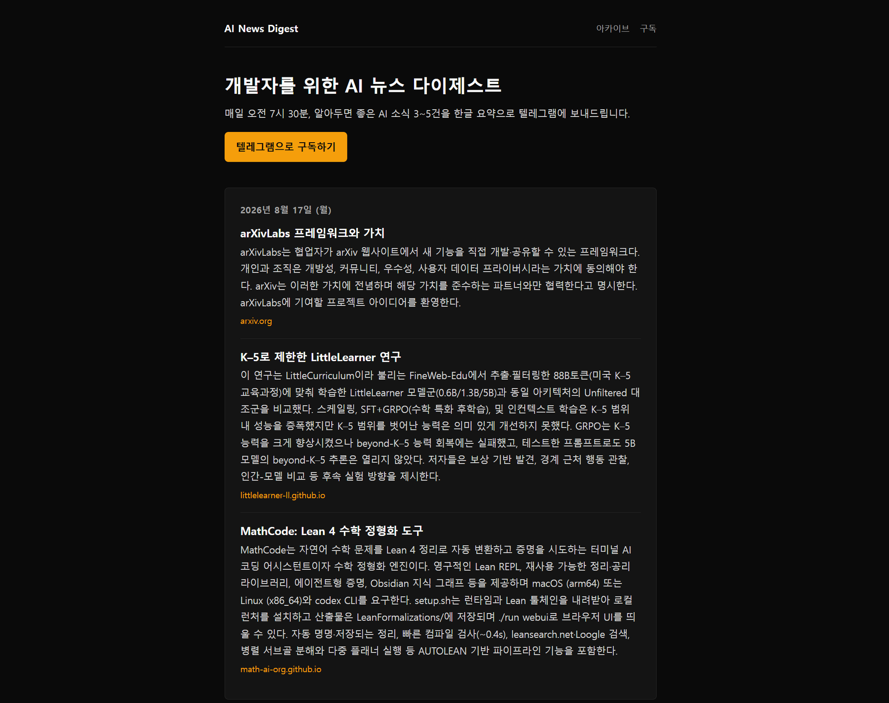
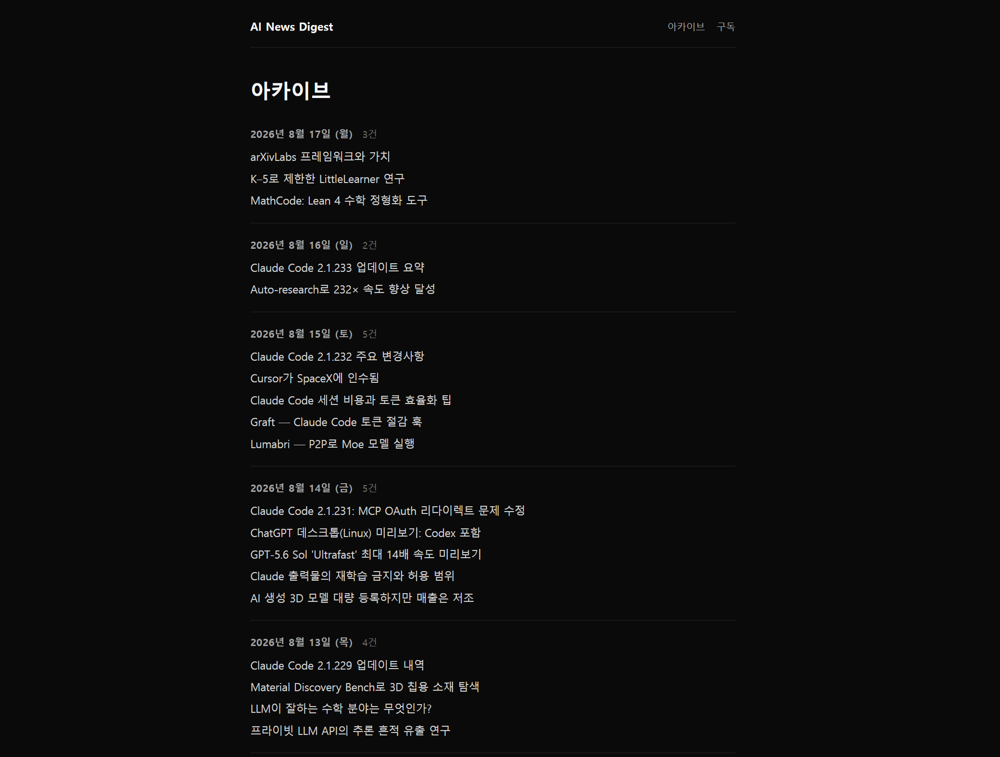
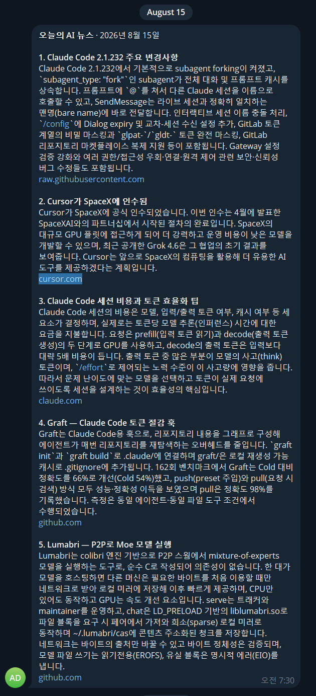

# AI News Digest

[](https://github.com/JongGurlHan/AINewsDigest/actions/workflows/ci.yml)

개발자가 알아두면 좋은 AI 소식 3~5건을 매일 오전 7시 30분(KST) 텔레그램으로 한글 요약해 보내는 뉴스 다이제스트 서비스.

- 서비스: https://ainewsdigest.site
- 구독: `https://t.me/ainewsdigest_bot?start=web` — 봇에게 `/start`를 보내면 그 자리에서 구독된다

## 화면

| 랜딩 (최신호) | 아카이브 |
|---|---|
|  |  |

매일 오전 7시 30분, 같은 내용이 텔레그램으로 나간다.




## 어떻게 동작하나

매일 아침 두 개의 배치가 30분 간격으로 돈다. 생성이 07:00에 실패해도 07:15 재시도가 있어
사람이 SSH로 들어가지 않아도 그날 발송이 살아난다.

```
07:00  생성
┌──────────────┐   ┌──────────────┐   ┌──────────────┐   ┌──────────────┐   ┌──────────────┐
│   수집       │──▶│   선별       │──▶│   크롤링     │──▶│   요약       │──▶│   조립·저장  │
│ HN Algolia   │   │ LLM 1~5점    │   │ jsoup 본문   │   │ LLM 한글     │   │ HTML 4,000자 │
│ RSS·CHANGELOG│   │ 상위 8건     │   │ 실패분 탈락  │   │ 상위 3~5건   │   │ PENDING/EMPTY│
└──────────────┘   └──────────────┘   └──────────────┘   └──────────────┘   └──────────────┘
   URL 정규화 →        3점 미만은          SafeUrlPolicy       건당 600자         DB 저장
   최근 7일 중복 제외   전부 탈락           (SSRF 차단)         이내

07:15  생성 재시도 (이미 있으면 무해하게 반환)

07:30  발송
┌──────────────┐   ┌──────────────┐   ┌──────────────┐
│ 미발송 조회  │──▶│ 구독자 순회  │──▶│ sent_at 기록 │──▶ healthchecks.io 핑
│ sent_at null │   │ 403 → 해지   │   │ 성공 1건 이상│
│ PENDING·EMPTY│   │ 429 → 대기   │   │ 일 때만      │
└──────────────┘   │ 5xx → 백오프 │   └──────────────┘
                   └──────────────┘
상시: 텔레그램 롱폴링으로 /start · /stop · /help 처리
웹:   /  ·  /archive  ·  /archive/{date}  (Thymeleaf SSR)
```

패키지는 5개 도메인 + 공통이다: `subscription` / `digest` / `collect` / `curation` / `delivery` / `global`.
자세한 구조와 트랜잭션 경계는 [docs/ARCHITECTURE.md](docs/ARCHITECTURE.md)에 있다.

## 기술 스택

| 구분 | 사용 기술 |
|---|---|
| 언어·런타임 | Java 21 (Gradle toolchain) |
| 프레임워크 | Spring Boot 4.0.7 (MVC, Data JPA, Thymeleaf, RestClient) |
| 빌드 | Gradle 9.5.1, Kotlin DSL |
| DB | PostgreSQL 16, Flyway 마이그레이션 |
| 외부 연동 | OpenAI Chat Completions, Telegram Bot API, HN Algolia API, jsoup, rome(RSS/Atom) |
| 테스트 | JUnit 5, Testcontainers PostgreSQL, WireMock (302건) |
| 배포 | Docker Compose, Oracle Cloud Always Free (ARM64) |
| 프론트 | Thymeleaf SSR + 순수 CSS (JavaScript 없음) |

## 주요 설계 결정

전문은 [docs/ADR.md](docs/ADR.md)에 있다. 그중 넷을 옮긴다.

### 제목만 보고 요약하지 않는다 — 본문을 직접 크롤링한다 (ADR-006)

HN Algolia는 `title`·`url`·`points`만 준다. 제목만으로 "3~4문장 한글 요약"을 시키면 모델이
내용을 지어내고, 그 환각이 매일 아침 확신에 찬 문장으로 발송된다. 그래서 선별된 기사만
jsoup으로 본문을 받아 요약하고, 본문을 못 받은 기사는 후보에서 탈락시킨다.

### 크롤링 대상 IP를 검증하고 리다이렉트를 직접 추적한다 (ADR-017)

크롤링할 URL은 우리가 고른 것이 아니라 **HN에 아무나 올린 것**이다. points 30만 넘기면
임의의 주소를 서버가 GET 하게 만들 수 있고, 받아온 본문은 요약을 거쳐 공개 아카이브에
게시되고 구독자 전원에게 발송된다 — 읽기만 되는 SSRF가 아니라 유출 경로까지 완성돼 있다.
`SafeUrlPolicy`가 해석된 모든 IP를 검사하고, `followRedirects(false)`로 홉마다 다시 검사한다.

### 발송 여부는 `status`가 아니라 `sent_at`으로 판정한다 (ADR-014, ADR-018)

"오늘의 AI 뉴스는 없습니다"도 정상 발송이므로 EMPTY를 SENT로 덮으면 그날의 기록이 사라진다.
`status`는 콘텐츠 성격, `sent_at`은 발송 여부로 축을 나눴다. 그리고 전원이 실패한 날에는
`sent_at`을 비워 둔다 — 채우면 멱등성 체크가 재실행을 영구히 막아, 아무도 받지 못한
다이제스트가 "발송 완료"로 남고 수동 재실행조차 아무 일도 하지 않는다.

### 테스트 DB는 H2가 아닌 Testcontainers PostgreSQL (ADR-011)

이전 설정은 테스트가 `create-drop` + Flyway 비활성이라 **마이그레이션이 한 번도 실행되지 않은
채 전부 통과**했다. 오타 하나가 배포 시점 `validate`에서야 드러나고, 그게 새벽이면 아침 발송이
통째로 날아간다. 테스트도 실제 PostgreSQL 컨테이너에서 Flyway를 돌린다.

## 로컬 실행

Docker Desktop이 실행 중이어야 한다 (앱·DB 컨테이너와 테스트용 Testcontainers 모두 필요).

```bash
git clone https://github.com/JongGurlHan/AINewsDigest.git
cd AINewsDigest

cp .env.example .env
# .env를 열어 OPENAI_API_KEY, TELEGRAM_BOT_TOKEN 등을 채운다.
# .env는 .gitignore에 있다 — 실제 키를 커밋하지 말 것.

docker compose up -d --build
```

- 웹: http://localhost:8080
- 로그: `docker compose logs -f app`
- 종료: `docker compose down` (DB 볼륨은 남는다. 데이터까지 지우려면 `down -v`)

키 없이 웹 화면만 보려면 `.env`의 값을 비워 둔 채로도 기동된다. 다만 생성·발송 배치와
텔레그램 폴링은 동작하지 않는다.

### 배치를 지금 돌려보기

스케줄을 기다리지 않고 한 번만 실행한다. 스케줄 실행과 같은 경로(날짜·알림·핑 규칙 포함)를 탄다.

```bash
docker compose run --rm app --ainewsdigest.run=generate --ainewsdigest.telegram.polling.enabled=false
docker compose run --rm app --ainewsdigest.run=send --ainewsdigest.telegram.polling.enabled=false
```

인자는 ENTRYPOINT(`java -jar /app/app.jar`) 뒤에 붙는다. 이 컨테이너는 포트를 게시하지 않으므로
운영 인스턴스가 떠 있어도 충돌하지 않는다. 작업이 끝나도 웹 서버로 계속 살아 있으니
로그로 결과를 확인한 뒤 `Ctrl-C`로 끝낸다.

**폴링을 끄는 인자를 빠뜨리지 말 것.** 텔레그램 `getUpdates`는 같은 봇 토큰으로 두 프로세스가
동시에 붙으면 양쪽 모두에 409를 돌려준다:

```
{"ok":false,"error_code":409,
 "description":"Conflict: terminated by other getUpdates request; ..."}
```

운영 인스턴스의 폴러와 이 일회성 컨테이너의 폴러가 서로를 끊어 구독 명령(`/start`·`/stop`)이
그동안 처리되지 않는다. 게다가 폴러는 단발 실패를 로그로 남기지 않고 연속 20회(약 10분)에
도달해야 ERROR를 내므로, 조용히 죽은 채로 지나간다.

### 컨테이너 없이 실행

PostgreSQL이 로컬 5432에 떠 있어야 한다.

```bash
./gradlew bootRun        # Windows cmd/PowerShell: gradlew.bat bootRun
```

## 테스트

Docker Desktop이 떠 있어야 한다 — 테스트가 PostgreSQL 컨테이너를 직접 띄운다 (ADR-011).

```bash
./gradlew test           # 테스트만
./gradlew build          # 컴파일 + 테스트 + 정적 검사
```

리포트는 `build/reports/tests/test/index.html`에서 본다. CI에서도 같은 명령이 돌고,
리포트는 워크플로 실행의 `test-reports` 아티팩트로 올라간다.

## 문서

- [docs/PRD.md](docs/PRD.md) — 목표, 발송 규칙, MVP 범위
- [docs/ARCHITECTURE.md](docs/ARCHITECTURE.md) — 패키지 구조, 데이터 흐름, 트랜잭션 경계
- [docs/ADR.md](docs/ADR.md) — 설계 결정과 트레이드오프 18건
- [docs/UI_GUIDE.md](docs/UI_GUIDE.md) — 다크모드 팔레트와 안티패턴
- [docs/DEPLOY.md](docs/DEPLOY.md) — Oracle Cloud 배포·운영 런북

## 배포

전체 절차는 [docs/DEPLOY.md](docs/DEPLOY.md)에 있다 — OCI 테넌시 준비부터 백업·장애 대응까지.

Oracle Cloud Always Free(ARM64) 인스턴스 한 대에 앱·PostgreSQL·Caddy를 Compose로 올린다.
운영에서는 프로덕션 오버라이드를 얹어 Caddy가 80/443을 받고 Let's Encrypt 인증서를 자동 발급한다.

```bash
docker compose -f docker-compose.yml -f docker-compose.prod.yml up -d --build
```

앱의 8080은 로컬·운영 모두 `127.0.0.1`에만 묶는다. Spring Security가 없어(MVP 제외) 외부에
열리는 순간 익명 공개이고, Docker가 게시한 포트는 호스트 방화벽을 우회해 서버 쪽에서
막아줄 수도 없다. 외부 트래픽은 Caddy만 받는다.

**자동 배포(CD)는 MVP 범위 밖이다** — CI는 테스트만 돌리고, 배포는 서버에서 수동으로 실행한다.
GitHub Actions 러너는 x86_64인데 운영 서버는 ARM64라 이미지 배포에는 크로스 빌드가 따로 필요하다.
